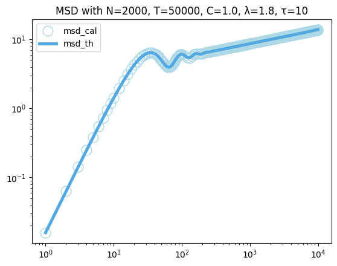

Application
===========

GenML is a Python library designed for generating Mittag-Leffler
correlated noise (abbreviated as M-L noise), which is widely used in
modeling complex physical systems. This notebook shows an application of
GenML, illustrating the simulation of anomalous diffusion driven by M-L
noise, along with the calculation of corresponding mean squared
displacement (MSD).

Importation and Parameters
--------------------------

First, get started by having all the necessary tools and libraries
imported.

.. code:: python

   import genml
   from genml.mittag_leffler import ml

   import numpy as np
   from tqdm.notebook import tqdm
   from matplotlib import pyplot as plt

Before diving into the diffusion generation, it’s essential to set up
some fundamental parameters that define the properties of the noise we
intend to generate, such as the number of sequences, length of each
sequence, amplitude coefficient, and others.

.. code:: python

   # Parameters
   N = 2000  # Number of sequences
   T = 50000  # Length of each sequence
   C = 1.0  # Amplitude coefficient
   lamda = 1.8  # Mittag-Leffler exponent
   tau = 10  # Characteristic memory time
   seed = None # Random seed

Simulating the Anomalous Diffusion Driven by M-L Noise
------------------------------------------------------

This section demonstrates the simulation of anomalous diffusion driven
by M-L noise, which can be described by the Langevin equation:

.. math:: \frac{{\rm d}x(t)}{{\rm d}t} = \xi (t)

We utilize the ``mln`` API from the GenML library to generate M-L noise
sequences. Subsequently, by superimposing the noise sequences along the
time dimension, we can obtain the diffusion trajectory :math:`x(t)`
driven by the M-L noise.

.. code:: python

   # Generate M-L noise sequences
   xi = genml.mln(N, T, C, lamda, tau, seed)

   # Accumulate M-L noise to generate anomalous diffusion
   x = np.hstack([np.zeros((xi.shape[0], 1)), np.cumsum(xi, axis=1)])
   x = np.array(x)

Calculation of the Mean Squared Displacement
--------------------------------------------

MSDs are crucial for understanding the properties of anomalous
diffusion. Here we calculate both the actual MSD values from the
generated trajectories and the theoretical MSD values.

.. code:: python

   compute_list = [i for i in range(1, 10)] + [2 * i for i in range(5, 50)] + \
           [10 * i for i in range(10, 100)] + [50 * i for i in range(20, 200)]
   compute_list = np.array(compute_list)

-  When calculating the actual MSD values, we employ the following
   equation:

.. math::

    \text{MSD}(t) = \langle |x(t) - x(0)|^2 \rangle 

where :math:`\langle \cdot \rangle`
denotes the ensemble average.

-  For computing the theoretical MSD values, we use the formula:

.. math::  \text{MSD}(t) = 2 \int_{0}^{t} (t - s) C(s) \, {\rm d}s 

Here, :math:`C(s)` represents the autocorrelation function of M-L noise.
Numerical values of the theoretical MSD are obtained through a numerical
integration using the composite trapezoidal rule.

.. code:: python

   # Calculate actual MSD values
   msd_cal = []
   for i in tqdm(compute_list):
       sd = np.sum((x[:, :-i] - x[:, i:]) ** 2, axis=1) / (T - i)
       msd_cal.append(sd.mean())

.. code:: python

   # Function to calculate the autocorrelation values
   def CC(s):
       return C * ml(-(abs(s) / tau) ** lamda, alpha=lamda) / (tau ** lamda)

   # Function defining the integrand for MSD
   def integrand(s, t):
       return (t - s) * CC(s)

   # Function to perform composite trapezoidal integration
   def integrate_trapezoidal(f, a, b, n):
       h = (b - a) / n
       result = 0.5 * (f(a) + f(b))
       for i in range(1, n):
           result += f(a + i * h)
       result *= h
       return result

   # Function to calculate the theoretical MSD
   def MSD(t):
       integral_values = [integrate_trapezoidal(lambda s: integrand(s, ti), 0, ti, 5000) for ti in tqdm(t)]
       return 2 * np.array(integral_values)

   msd_th = MSD(compute_list)

Comparision of actual and theoretical MSDs
~~~~~~~~~~~~~~~~~~~~~~~~~~~~~~~~~~~~~~~~~~

.. code:: python

   plt.plot(compute_list, msd_cal, 'o', label='msd_cal', color='lightblue', markerfacecolor='none', markersize=12)
   plt.plot(compute_list, msd_th, label='msd_th', color='#53A8E1', linewidth=3.6)
   plt.title(f'MSD with N={N}, T={T}, C={C}, λ={lamda}, τ={tau}')
   plt.xscale('log')
   plt.yscale('log')
   plt.legend()
   plt.show()

